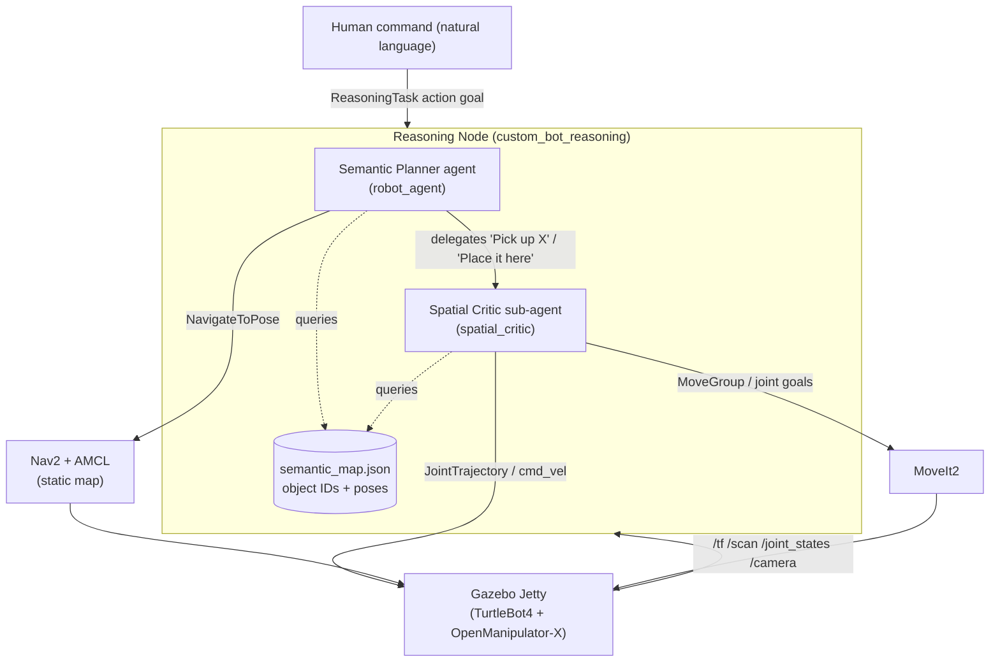

# Embodied Household Agent — ADK Reasoning Layer for ROS2

A **Google ADK multi-agent reasoning layer** that drives a simulated household robot (a
**TurtleBot4** mobile base + **OpenManipulator-X** arm) in **Gazebo**, turning natural-language
commands like *"Pick up the red cylinder and place it in the kitchen"* into safe, deterministic
Nav2 and MoveIt2 motion — with **no per-task programming**.

The LLM reasons about *intent* (which object, which action) and emits high-level tool calls; a
deterministic control layer beneath it computes every navigation goal and every joint-space IK
target in code. The agent never hallucinates raw coordinates.

> **Stack:** ROS2 Lyrical Luth · Gazebo Jetty · Nav2 (AMCL) · MoveIt2 · Google ADK 2.0 (Gemini 2.5 Pro)

---

## Table of Contents
- [Problem & Solution](#problem--solution)
- [Architecture](#architecture)
- [Agent Design](#agent-design)
- [Repository Layout](#repository-layout)
- [Prerequisites](#prerequisites)
- [Setup & Build](#setup--build)
- [Running the System](#running-the-system)
- [Prompting the Robot](#prompting-the-robot)
- [Tested Scenarios](#tested-scenarios)
- [Known Limitations](#known-limitations)
- [Security](#security)
- [Deployability](#deployability)
- [Agent Skills (the Build)](#agent-skills-the-build)
- [Testing (BDD)](#testing-bdd)
- [Course Concepts Demonstrated](#course-concepts-demonstrated)

---

## Problem & Solution

Bridging unstructured human intent (*"bring me the red block from the kitchen"*) to rigid robotic
stacks (Nav2, MoveIt2) traditionally requires hardcoded state machines — one brittle script per
task. **This project inserts an agentic reasoning layer** that interprets the command, consults a
semantic map of the environment, and orchestrates navigation and manipulation as a sequence of
tool calls, so new tasks require no new glue code.

The key design decision is a strict split of responsibility:

| Layer | Owns | Guarantees |
|-------|------|------------|
| **LLM agents (ADK)** | *what* to do — object selection, task routing, delegation | Flexible zero-shot semantic grounding |
| **Deterministic code** | *how* to do it — Nav2 goals, IK, grasp geometry | Safe, repeatable motion; no hallucinated coordinates |

---

## Architecture



- **Simulation & world:** ROS2 (Lyrical Luth) + Gazebo (Jetty), AWS RoboMaker Small House world
  (`src/custom_bot_gazebo/worlds/small_house.world`).
- **Robot:** Unified XACRO/URDF combining TurtleBot4 + OpenManipulator-X
  (`src/custom_bot_description/urdf/robot.urdf.xacro`).
- **Navigation:** Nav2 with **AMCL localizing against a pre-built static occupancy map**
  (`maps/small_house.yaml`) — a deliberate choice over live SLAM for localization stability.
- **Manipulation:** MoveIt2 with a custom planar IK solver and SRDF (`custom_bot_moveit_config`).
- **World knowledge:** A **pre-extracted semantic map** (`semantic_map.json`, generated offline from
  the world SDF by `scripts/extract_semantic_map.py`) — the agent reads object IDs and poses from
  it rather than from live vision.
- **Brain:** The ADK reasoning node (`custom_bot_reasoning/reasoning_node.py`), exposed as a single
  ROS2 Action Server.

### From intent to motion
`navigate_to_standoff_tool` computes a standoff pose *in code* from the robot's TF pose and the
object's mapped position (the LLM never picks XY). Because Nav2's `xy_goal_tolerance` (0.10 m) is
coarser than the arm's usable reach margin (~0.30 m ceiling), a **closed-loop "creep" routine**
then edges the base forward in small steps, re-reading the live arm-frame radius from TF until the
target is inside the IK envelope. The grasp is a single **atomic top-down sequence** (open → hover →
re-measure radial error live → descend → close → verify → lift), with a **code-level grip check**
(gripper joint position vs. a calibrated hold threshold) instead of unreliable vision verification.

---

## Agent Design

A **two-tier ADK multi-agent system** (`reasoning_node.py`):

**Semantic Planner** (`robot_agent`) — supervisor. Classifies the request (pure navigation / pick /
pick-and-place) and routes it. Tools:

| Tool | Purpose |
|------|---------|
| `list_objects_tool` | List all object IDs in the environment |
| `get_object_details_tool` | Look up an object's pose (x, y, yaw) |
| `navigate_to_standoff_tool` | Grasp approach — tight standoff, then creep closer |
| `navigate_to_object_tool` | Clearance approach to an object (no grasp intended) |
| `navigate_to_room_tool` | Go to the open centre of a set of objects (a room/area) |
| `navigate_and_face_tool` | Raw point-and-face navigation from explicit coordinates |

**Spatial Critic** (`spatial_critic`) — delegated sub-agent for manipulation
(`sub_agents=[spatial_critic]`). Runs a veto-gated grasp:

| Tool | Purpose |
|------|---------|
| `check_grasp_feasibility_tool` | Veto check: is the object kinematically reachable? |
| `readjust_base_tool` | Recovery re-approach: creep closer on a feasibility veto |
| `execute_grasp_tool` | Atomic top-down grasp with code-level grip verification |
| `place_tool` | Release the held object at the current pose (refuses if nothing held) |
| `get_nearby_objects_tool` | Collision/occupancy check around a point |

---

## Repository Layout

```
src/
├── custom_bot_description/   Unified TurtleBot4 + OpenManipulator-X URDF/XACRO
├── custom_bot_gazebo/        Gazebo world, models, spawn + bridge launch
├── custom_bot_navigation/    Nav2 params, AMCL, static maps, navigation launch
├── custom_bot_moveit_config/ MoveIt2 SRDF, kinematics, controllers, move_group launch
├── custom_bot_interfaces/    ReasoningTask.action (the agent's ROS2 interface)
├── custom_bot_reasoning/     ADK reasoning node + BDD (behave) tests
├── open_manipulator/         OpenManipulator-X description (git submodule)
├── turtlebot4/               TurtleBot4 description (git submodule)
└── create3_sim/              iRobot Create 3 common (vendored)
scripts/                      Build, run, record, and semantic-map extraction helpers
.agents/skills/               Agent Skills used during development (the "vibe coding" build)
```

---

## Prerequisites

- **ROS2 Lyrical Luth** and **Gazebo Jetty** (with `ros_gz_sim`, `ros_gz_bridge`, `ros_gz_image`)
- **Nav2** and **MoveIt2** available on the machine (binary or built from source; the run scripts
  source a `~/moveit_ws` overlay for MoveIt2)
- **Python packages:** `google-adk`, `google-genai` (the ADK agent + Gemini client), plus
  `opencv-python` for `cv_bridge`
- **A Gemini API key** (`GEMINI_API_KEY`)
- On a headless VM, software rendering via Mesa `llvmpipe` (see run scripts)

---

## Setup & Build

```bash
# 1. Clone with submodules (OpenManipulator-X + TurtleBot4)
git clone --recurse-submodules git@github.com:indikabw/capstone-vc.git
cd capstone-vc

# 2. Install ROS dependencies (rosdep + libompl on Lyrical)
bash setup_dependencies.sh

# 3. Install the ADK / Gemini Python packages
pip install google-adk google-genai opencv-python

# 4. Provide your Gemini API key (NEVER commit this file — it is git-ignored)
echo "GEMINI_API_KEY=your_key_here" > .env

# 5. Build (ALWAYS use the wrapper — it applies the required environment workarounds)
bash scripts/colcon_build.sh
```

> **Why `scripts/colcon_build.sh` and not `colcon build`?** The wrapper bakes in two workarounds this
> stack needs: it points `CMAKE_PREFIX_PATH` at `cmake_fix/` (a drop-in
> `ament_cmake_target_dependencies` config some vendored packages need on Lyrical), and it disables
> warnings-as-errors under GCC 15. Both are otherwise easy to re-diagnose from scratch.

---

## Running the System

The full stack is four processes: **simulation → navigation → MoveIt2/controllers → reasoning node.**
`scripts/run_test.sh` orchestrates all of them, sends a command, records video, and cleans up. It is
the fastest way to see an end-to-end run:

```bash
# Runs the default command ("Pick up the red cylinder") end-to-end and records video
bash scripts/run_test.sh

# Override the command for any scenario
TEST_COMMAND="Go to the kitchen" bash scripts/run_test.sh
```

<details>
<summary><b>Or launch the four processes manually</b> (useful for debugging)</summary>

```bash
# Common environment (headless VM)
source /opt/ros/lyrical/setup.bash
source ~/moveit_ws/install/setup.bash        # MoveIt2 overlay
source install/setup.bash
export LIBGL_ALWAYS_SOFTWARE=1 GALLIUM_DRIVER=llvmpipe
export $(grep -v '^#' .env | xargs)          # GEMINI_API_KEY

# 1. Simulation (headless)
ros2 launch custom_bot_gazebo sim.launch.py headless:=true

# 2. Navigation (Nav2 + AMCL against maps/small_house.yaml)
ros2 launch custom_bot_navigation navigation.launch.py

# 3. MoveIt2 move_group + arm/gripper controllers
ros2 launch custom_bot_moveit_config demo.launch.py

# 4. The ADK reasoning node (requires GEMINI_API_KEY; exits if unset)
ros2 run custom_bot_reasoning reasoning_node
```

Run the Gazebo GUI instead of headless with `headless:=false`.
</details>

---

## Prompting the Robot

The reasoning node exposes a single ROS2 Action Server, `/reasoning_task`, using
[`custom_bot_interfaces/action/ReasoningTask`](src/custom_bot_interfaces/action/ReasoningTask.action):

```
# Goal
string command      # natural-language instruction
---
# Result
bool   success
string summary      # what the agent did / why it stopped
---
# Feedback
string current_stage # "sampling image" -> "reasoning" -> ...
```

Send a command directly:

```bash
ros2 action send_goal /reasoning_task custom_bot_interfaces/action/ReasoningTask \
  "{command: 'Pick up the red cylinder'}"
```

…or via the helper (which also runs an independent physics check on the result):

```bash
python3 scripts/test_nav_and_pick.py --command "Pick up the red cylinder"
```

**How the command is decoded.** The planner calls `list_objects_tool` to see what exists, matches
your words to object IDs, then routes to exactly one path:

| You say… | Agent path |
|----------|-----------|
| *"Go to the kitchen"* | `navigate_to_room_tool` (kitchen object IDs) → stop |
| *"Go to the TV"* | `navigate_to_object_tool(TV_01_001)` → stop |
| *"Pick up the red cylinder"* | `navigate_to_standoff_tool` → delegate *Pick up 'red_cylinder'* to the critic |
| *"Pick up the red cylinder and place it in the kitchen"* | standoff → pick → `navigate_to_room_tool` (kitchen) → delegate *Place it here* |
| *"…place it near the refrigerator"* | standoff → pick → `navigate_to_object_tool(Refrigerator_01_001)` → place |

You prompt in plain language — object IDs (e.g. `red_cylinder`, `Refrigerator_01_001`, `TV_01_001`,
`Bed_01_001`) are resolved by the agent, not by you.

---

## Tested Scenarios

Exercised in the AWS RoboMaker Small House world (recorded runs are produced by the run scripts;
`.mp4` artifacts are git-ignored). The grasp target is `red_cylinder` at `(-1.86, -2.0, 0.19)`, which
sits ~2.7 m from the robot's spawn — so pick scenarios exercise full Nav2 path planning, not just an
in-place adjustment.

| # | Command | Capability | Status |
|---|---------|-----------|--------|
| 1 | "Go to the kitchen" | Room navigation | ✅ Verified success (physics-confirmed run) |
| 2 | "Go to the bedroom" | Room navigation | ✅ Demonstrated (recorded run) |
| 3 | "Go to the TV" | Object navigation | ✅ Demonstrated (recorded run) |
| 4 | "Go to the yoga ball" | Object navigation | ✅ Demonstrated (recorded run) |
| 5 | "Go to the kitchen, then the bedroom" | Sequential navigation | ✅ Demonstrated (recorded run) |
| 6 | "Pick up the red cylinder" | Nav + top-down grasp | ✅ Demonstrated (incl. a physics-confirmed success) — see [Known Limitations](#known-limitations) |
| 7 | "Pick up the red cylinder and place it in the kitchen" | Pick-and-place (room) | ⚠️ Demonstrated end-to-end; not yet reliably repeatable |
| 8 | "Pick up the red cylinder and place it near the refrigerator" | Pick-and-place (object) | ⚠️ Demonstrated end-to-end; not yet reliably repeatable |

Navigation was the reliable foundation of the project; the grasp-dependent scenarios (6–8) are the
ones with the repeatability limits described below.

---

## Known Limitations

**Grasping works but is not yet reliably repeatable, and we deliberately do not quote a single
headline success rate** — trial counts are small and the runs to date were not controlled for
confounds. We have identified, but not yet fully disentangled, three contributors to run-to-run
variance:

1. **A very thin grasp margin** (~1–2 mm of jaw-to-object interference), so millimetre-scale
   simulation contact jitter (physics step order, controller settle sequence) can flip a firm grip
   into a miss.
2. **LLM sampling nondeterminism** — the planner runs a cloud model without a fixed seed, so it can
   legitimately choose different (still valid) action sequences across runs.
3. **Cloud/network variability** — every agent step is a remote model call, so an unstable connection
   can trip the bounded watchdogs (surfacing as a "pick failure" that is really a timeout) or stretch
   wall-clock timing under an in-progress grasp.

What we *can* state with confidence is narrower: the geometry/control layer is deterministic by
construction, and the physical grasp — once invoked — makes no cloud calls, so a failure at the
closing stage is a simulated-contact outcome, not a reasoning error. **Next step:** an N-trial
evaluation harness run over a stable connection that logs the tool-call sequence, per-call API
latency, and watchdog events alongside each physics-verified outcome, so failures can be *attributed*
(physics vs. planning vs. network) rather than inferred from a single run.

---

## Security

- **Discrete trigger, not a continuous loop.** The LLM is invoked **only** on an explicit
  `ReasoningTask` action goal — never per camera frame and never in an open reasoning loop. This
  controls cloud cost, prevents API rate-limiting, avoids ROS2 callback starvation, and stops the
  agent from drifting in an unbounded loop.
- **Bounded watchdogs** wrap every Nav2, MoveIt2, and overall-task call, so a stalled cloud response
  or planner can never hang the robot.
- **No secrets in the repo.** The node reads `GEMINI_API_KEY` from the environment and exits cleanly
  if it is absent. `.env` is git-ignored and is **not** tracked in this repository.

---

## Deployability

- Every node — including the ADK agent — builds through a standard `colcon` pipeline wrapped in
  `scripts/colcon_build.sh` for reproducibility on a clean checkout.
- The architecture is modular: description, navigation, MoveIt config, interfaces, and reasoning are
  separate ROS2 packages, and the stack spins up on any compatible ROS2 Lyrical machine.
- Development used a **split environment** (local macOS editor + remote Linux simulation VM); the
  `remote-ros2-development` skill documents the `rsync`/build/run workflow across the two.

---

## Agent Skills (the Build)

This project was largely **"vibe coded"** with **Google Antigravity** as the primary agent-in-the-loop
(supplemented by Claude Code), driven by custom Agent Skills in [`.agents/skills/`](.agents/skills/):

| Skill | Role |
|-------|------|
| `remote-ros2-development` | Autonomous `rsync` sync + build/run across the Mac↔VM split (never `--delete`); VM zombie-process cleanup |
| `headless-simulation-monitoring` | Headless Gazebo with `llvmpipe`, clock-sync checks, and recovery from orphaned-Gazebo `/clock` conflicts that crash the TF2 tree |
| `ros2-navigation-controller` | Guidelines for unifying the two URDFs, generating the MoveIt2 SRDF, and configuring Nav2 for the arm-modified footprint |
| `camera-agent-reasoning` | Running ADK reasoning inside a ROS2 node without blocking sensor callbacks (MultiThreadedExecutor + image locking + discrete trigger) |
| `bdd-gherkin-specs` | Behavior-Driven Development with `behave`, mocking the Nav2/MoveIt2 action servers |
| `rosbag-video-converter` | Converting recorded `rosbag2` camera topics into demo videos |

---

## Testing (BDD)

The ADK reasoning logic is testable **without** Gazebo. `behave` specs in
`src/custom_bot_reasoning/features/` mock the Nav2 and MoveIt2 action servers (returning success on
correct goals), so the agent's planning and tool routing can be exercised fast and in isolation:

```bash
cd src/custom_bot_reasoning
behave
```

---

## Course Concepts Demonstrated

| Concept | Where |
|---------|-------|
| **Multi-agent system (ADK)** | Semantic Planner + delegated Spatial Critic sub-agent (`reasoning_node.py`) |
| **Antigravity** | Primary agent-in-the-loop for the entire build (see demo video) |
| **Security features** | Discrete action trigger, bounded watchdogs, no committed secrets |
| **Deployability** | Modular colcon packages + reproducible `colcon_build.sh` wrapper |
| **Agent Skills** | Six custom skills in `.agents/skills/` driving development |

---

*Simulation-only research/education project built for the Kaggle 5-Day AI Agents Intensive capstone.
Licensed under Apache 2.0.*
